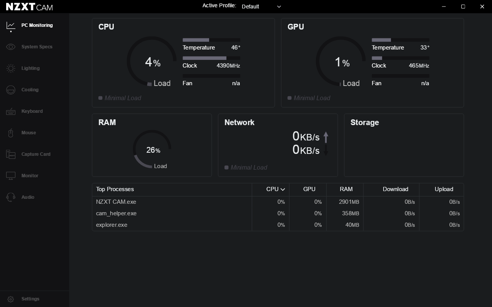

# NZXT CAM on Linux (Wine)

Getting **NZXT CAM 4.76.5** to actually run under Wine on Linux.

Out of the box CAM installs fine but never gets past its loading screen. Four
separate problems stack up behind each other. This repo fixes all of them.



Verified on Arch Linux, `wine-11.16`, NZXT CAM 4.76.5, KDE/Wayland.

---

## Quick start

```bash
sudo pacman -S --needed wine winetricks cabextract     # Arch
git clone <this repo> ~/dev/repos/nzxt_cam_linux
cd ~/dev/repos/nzxt_cam_linux
./scripts/setup.sh ~/Downloads/NZXT-CAM-Setup.exe
nzxt-cam
```

Already installed CAM? Omit the installer path and `setup.sh` will just apply the fixes.

The prefix defaults to `~/pfx/nzxt_cam`; override with `WINEPREFIX=... ./scripts/setup.sh`.

---

## What works / what doesn't

| Works | Doesn't |
|---|---|
| UI, navigation, all pages | CPU / motherboard **temperatures** |
| CPU load %, clock | **Fan speeds** and fan control |
| RAM usage | **GPU** monitoring (`No supported graphics cards`) |
| Network throughput | |
| Per-process CPU/RAM/net table | |
| Lighting / Cooling / Audio pages render | |

**Sensors will never work under Wine.** CAM reads them through a kernel driver
(`cpuz162`, `cam_driver_mb.sys`). Wine has no kernel driver support, so you'll see:

```
err:ntoskrnl:ZwLoadDriver failed to create driver L"...\cpuz162": c0000142
```

Temperature and Fan stay `n/a`. This is not fixable in userspace.

**NZXT USB device control (Kraken, RGB & Fan controllers) is unverified** — I had no
NZXT hardware attached to test. Device *enumeration* is fixed (see fix #2/#3), but
Wine's `hidclass.sys` never calls `IoSetDeviceInterfacePropertyData`, so it doesn't
publish the `DEVPKEY_DeviceInterface_HID_VendorId`/`ProductId` that CAM filters on.
If your hardware doesn't appear, that's why.

> For **actual hardware control** on Linux, use [`liquidctl`](https://github.com/liquidctl/liquidctl)
> or [CoolerControl](https://gitlab.com/coolercontrol/coolercontrol) — they drive NZXT
> Kraken coolers, Smart Device, RGB & Fan Controllers and HUE 2 natively over hidraw.
> This repo is for people who specifically want CAM's UI.

---

## The four fixes

### 1. No fonts → blank window, then a renderer crash  ← the big one

**Symptom:** window renders white with no text; renderer then dies repeatedly with
`exitCode: -2147483645` (`0x80000003` STATUS_BREAKPOINT) and
`FATAL:check.cc(376)] Check failed: false. NOTREACHED`.

**Cause:** the prefix had no usable font for the families CAM asks for. Measured
live in the renderer via the Chrome DevTools Protocol:

```
Liberation Sans: 165   sans-serif: 0     <- generic families resolve to nothing
Noto Sans:       176   Segoe UI:   0
Tahoma:          162   Arial:      0
```

CAM's CSS is `"Segoe UI", sans-serif`. Both resolved to nothing, so every text node
had **height 0**, and Chromium hit a `NOTREACHED` when font fallback came up empty
while laying out the app shell.

Chromium maps `sans-serif` → Arial on Windows, so installing corefonts fixes the
generic families too.

**Fix:** `winetricks -q corefonts`.

Note: Wine's `FontSubstitutes` registry key does **not** help — that's a GDI
mechanism, and Chromium uses DirectWrite. You need the real font files.

### 2. Wine `propsys` is missing the HID property names

**Symptom:** stuck on the splash forever. `renderer.log`:

```
UnhandledRejection Error: Failed to start device resource emitter:
  Error { code: HRESULT(0x8002802B) }        # TYPE_E_ELEMENTNOTFOUND
fixme:propsys:propsys_GetPropertyDescriptionByName
  canonical_name not found L"System.DeviceInterface.Hid.VendorId"
```

**Cause:** `dlls/propsys/propsys_main.c` has a hardcoded `system_properties[]` table
containing exactly one `System.DeviceInterface.*` entry (Bluetooth). CAM asks for six
HID/WinUSB names; the lookup fails and the promise rejects.

**Fix:** `patches/01-propsys-hid-properties.patch` — adds the six entries. The
`PROPERTYKEY`s were already defined in Wine's `propkey.h`, so it's a 6-line addition.
It fixes both call sites: CAM's direct call, and Wine's own `PSGetPropertyKeyFromName`
inside the DeviceWatcher.

### 3. Wine's `DeviceWatcher.add_Removed` is an unimplemented stub

**Symptom:** after fix #2, the error code changes to `0x80004001` (`E_NOTIMPL`).

```
device_watcher_add_Added ...                          <- ok
fixme:enumeration:device_watcher_add_Removed ... stub! <- E_NOTIMPL
```

**Cause:** `dlls/windows.devices.enumeration/main.c` tracks handler lists for
`added`/`enumerated`/`stopped` but has none for `updated`/`removed`.

**Fix:** `patches/02-devicewatcher-updated-removed.patch` — adds both lists and
implements the four methods, mirroring the existing `add_Added` pattern.

### 4. CAM sits on `/splash` forever

**Cause:** CAM's `PrivateRoute` redirects every route to `/splash` while
`currentUser.isValid` is false. Its user model is a union:

```js
model("NoneUser",  {mode: literal("none")}) .volatile(() => ({isValid:false}))
model("GuestUser", {mode: literal("guest")}).volatile(() => ({isValid:true }))
```

Normally you'd click "continue without an account" — impossible when nothing renders.

**Fix:** write `{"mode":"guest"}` to
`DataStorage/latest/local/currentUser.json` (done by `setup.sh`).

---

## Why the DLLs are re-linked "native"

Wine builds its PE DLLs with `-Wl,--wine-builtin`. A DLL carrying that marker is
**rejected** when you ask Wine to load it as `native`, and you get:

```
err:module:import_dll Library propsys.dll ... not found
```

So `build-wine-dlls.sh` re-links both without that flag, and `setup.sh` registers
`HKCU\Software\Wine\DllOverrides` → `native` for each. Dropping a patched DLL into
`C:\windows\system32` alone does nothing: Wine loads builtins from
`/usr/lib/wine/x86_64-windows/`, and the copies in the prefix are only version-check
placeholders.

## Wine version compatibility

`prebuilt/` is built against the version in `prebuilt/BUILT_AGAINST` (currently
`11.16`). On a different Wine version, rebuild:

```bash
./scripts/build-wine-dlls.sh          # uses your installed wine version
./scripts/setup.sh                    # reinstall them
```

Needs a PE cross-compiler (`mingw-w64-gcc` on Arch, `gcc-mingw-w64-x86-64` on Debian).

Both patches are small and upstream-shaped — worth filing at
[WineHQ Bugzilla](https://bugs.winehq.org/); they affect any app that enumerates HID
devices through `Windows.Devices.Enumeration`.

## Troubleshooting

**"NZXT CAM can not start while cam_helper.exe is running"** — orphaned helpers:

```bash
WINEPREFIX=~/pfx/nzxt_cam wineserver -k
```

**Still no text** — confirm corefonts landed:

```bash
ls ~/pfx/nzxt_cam/drive_c/windows/Fonts/arial.ttf
```

**Inspect the live UI** (very useful — bypasses compositor/screenshot issues):

```bash
nzxt-cam --remote-debugging-port=9222
curl -s http://127.0.0.1:9222/json    # then drive it over CDP
```

**Logs:** `~/pfx/nzxt_cam/drive_c/users/$USER/AppData/Roaming/NZXT CAM/logs/`
(`main.log`, `renderer.log`, `cam.log`, `cam_helper.log`).

**Undo everything:** delete the prefix (`rm -rf ~/pfx/nzxt_cam`) and
`~/.local/bin/nzxt-cam`. `setup.sh` also leaves `.stock-backup` copies of both
replaced DLLs in the prefix's `system32`.

## Notes

- CAM auto-updates. Updates replace `app.asar` but **not** the Wine DLLs, fonts, or
  guest-mode setting, so they survive. Set `skipUpdateOnStart` in `settings.json` to pin.
- No patch to `app.asar` is needed. CAM logs one harmless rejection
  (`[Core bug] CPU device should have CPU temperature channels`) because temps are
  unavailable; it no longer breaks the UI once fonts work.
- `privateMode` is on by default — CAM won't phone home with telemetry.

## Licensing

This repository's scripts, patches and docs are MIT (see `LICENSE`).

`prebuilt/*.dll` are compiled from patched Wine sources and are therefore
**LGPL-2.1-or-later** derivative works of Wine — see `NOTICE` for the
corresponding-source pointers and rebuild instructions.

No NZXT code or assets are redistributed here; get CAM from NZXT. This project
is unaffiliated with NZXT.
