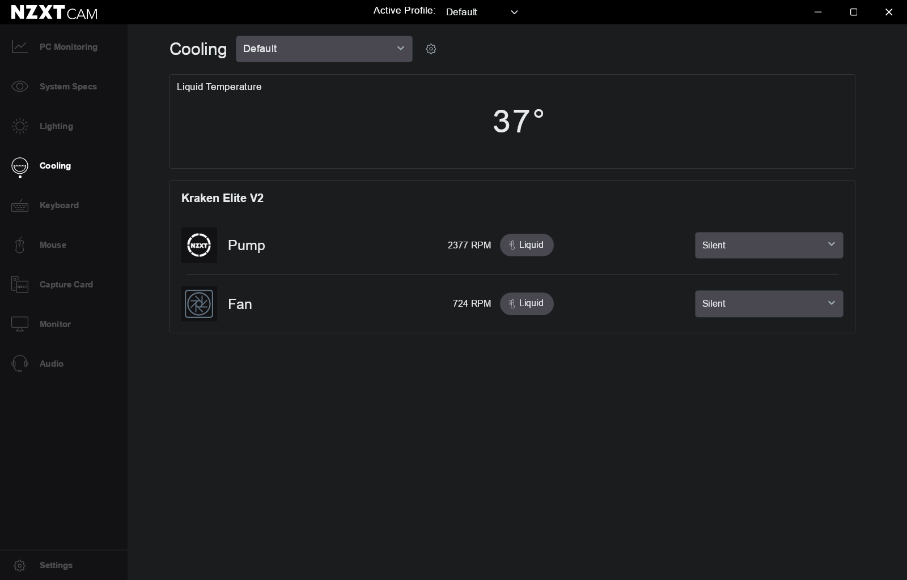
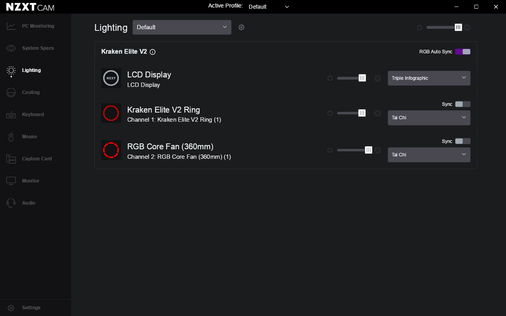

# NZXT CAM on Linux (Wine)

**NZXT CAM 4.76.5** running under Wine, detecting and driving an NZXT cooler,
including its LCD.

Out of the box CAM never leaves its loading screen. This repo applies the patches
needed to get most of it working.


CPU and GPU telemetry are read from Linux itself, so both report correctly and either
can drive the pump and fan curves or appear on the LCD:

| Cooling | Lighting |
|---|---|
|  |  |

Verified on Arch Linux, `wine-11.16`, KDE/Wayland, with an NZXT Kraken Elite V2
(`1e71:3012`).

---

## Install

You need `wine`, `winetricks`, `cabextract`, `curl` and `tar` first:

```bash
sudo pacman -S --needed wine winetricks cabextract curl tar   # Arch
sudo apt install wine winetricks cabextract curl tar          # Debian/Ubuntu
sudo dnf install wine winetricks cabextract curl tar          # Fedora
```

Then:

```bash
curl -L https://raw.githubusercontent.com/adds39939/nzxt_cam_linux/main/install.sh | bash
```

That downloads NZXT CAM, asks where to put the Wine prefix (default `~/pfx/nzxt_cam`),
builds the patched prefix and installs a `nzxt-cam` launcher. It offers to install two
Wine drivers with `sudo` — without those the cooler is not detected — and to start CAM
when you log in.

Start it with:

```bash
nzxt-cam
```

A `wine` package upgrade overwrites those two drivers, and the cooler stops being
detected until they are put back — re-run the installer after one.

### GPU readings

GPU temperature, clock and load come from `nvidia-smi`, which ships with the NVIDIA
driver:

```bash
sudo pacman -S nvidia-utils                  # Arch
sudo apt install nvidia-utils-<version>      # Debian/Ubuntu, match your driver
sudo dnf install xorg-x11-drv-nvidia-cuda    # Fedora
```

Without it the GPU is still detected and everything else keeps working — its readings
just stay `n/a`. AMD and Intel GPUs are not wired up yet. CPU readings need nothing
extra; `lm_sensors` is **not** required.

### Start on login

The installer offers this. To add it later, re-run the installer; to turn it off,
delete the entry:

```bash
rm ~/.config/autostart/nzxt-cam.desktop
```

CAM's own *start with Windows* setting does not work under Wine. Its **Start
minimized** setting pairs well with this if you would rather it sat in the tray.

### Display scaling

CAM always renders at 100%, so on a scaled display it comes out small. The installer
matches Wine's DPI to your desktop scale. Override it at any time:

```bash
NZXT_CAM_SCALE=1.5 nzxt-cam
```

## Uninstall

```bash
curl -L https://raw.githubusercontent.com/adds39939/nzxt_cam_linux/main/uninstall.sh | bash
```

That removes the Wine prefix — CAM, its settings, profiles and logs all live inside it
— along with the launcher, the autostart entry, and the menu entries and icons Wine
created. It then offers to put Wine's stock drivers back, which needs `sudo`.

It finds the prefix by reading it back out of the launcher, shows you what it is about
to delete and asks first.

```bash
ASSUME_YES=1 bash uninstall.sh      # unattended
KEEP_DRIVERS=1 bash uninstall.sh    # leave the patched Wine drivers in place
```

Something not working? See [`docs/troubleshooting.md`](docs/troubleshooting.md).

## What works

* ✅ **Kraken Elite V2 detected** (`1e71:3012`) and driven over WinUSB
* ✅ **Pump and fan curves**, applied and persisted
* ✅ **LCD** — live frames pushed to the display
* ✅ **Liquid temperature, pump and fan RPM**
* ✅ **CPU and GPU temperature, clock and load**, selectable as curve sources and on
  the LCD
* ✅ **Per-channel RGB lighting** on the cooler and its fans
* ✅ RAM usage, network throughput and the per-process table
* ✅ Every page renders, and the window follows your desktop's scaling

## Untested

* ❓ **Any NZXT device other than a Kraken Elite V2.** The work is generic rather than
  model-specific, so other coolers and RGB controllers may well work — but none have
  been tried.
* ❓ **Firmware update.** CAM ships this as separate binaries, so it likely exercises
  paths none of this work touched. Nothing here has ever written firmware to a cooler.

## What doesn't

* 🔧 **GPU fan speed** (CAM wants RPM, `nvidia-smi` only exposes a percentage),
  **AMD and Intel GPUs**, and **motherboard fan speeds and temperatures** are not
  implemented yet.
* 🚫 **Capture Card** needs a COM class Wine does not implement, and the page kills
  CAM's renderer. The launcher recovers from it automatically, so a click no longer
  leaves the app stuck — but making capture work is out of scope.

## Notes

* CAM auto-updates. Updates replace `app.asar` but not the Wine DLLs, fonts or
  settings, so they survive. Set `skipUpdateOnStart` in `settings.json` to pin.
* `privateMode` is on by default — CAM won't phone home with telemetry.
* No patch to `app.asar` is needed.
* What each Wine patch fixes, and why, is written up in
  [`docs/wine-fixes.md`](docs/wine-fixes.md).

## Building it yourself

A clone has no `prebuilt/`, so either let `install.sh` pull the release as usual:

```bash
git clone https://github.com/adds39939/nzxt_cam_linux
cd nzxt_cam_linux
./install.sh                    # fetches the release for the binaries
```

or build them, which needs a PE cross-compiler (`mingw-w64-gcc` on Arch,
`gcc-mingw-w64-x86-64` on Debian) and Wine's build dependencies (`flex`, `bison`,
`libusb-1.0-0-dev`):

```bash
./scripts/build-wine-dlls.sh    # builds everything into prebuilt/ (takes a while)
./scripts/setup.sh ~/Downloads/NZXT-CAM-Setup.exe
sudo ./scripts/install-wine-drivers.sh
```

Once `prebuilt/` exists, `install.sh` uses your local build rather than the release.
If CAM is already installed, omit the installer path and `setup.sh` just applies the
fixes. The prefix defaults to `~/pfx/nzxt_cam`; override with `WINEPREFIX=...`.

Releases are built against the Wine version in [`WINE_VERSION`](WINE_VERSION)
(currently `11.16`), and `install.sh` warns if yours differs. To rebuild against your
own:

```bash
./scripts/build-wine-dlls.sh $(wine --version | sed s/^wine-//)
./scripts/setup.sh                    # reinstall them
```

None of the Wine changes are CAM-specific. They fix gaps that affect any application
that enumerates devices through `Windows.Devices.Enumeration`, uses WinUSB, or asks
cfgmgr32 for a device node's properties.

## Licensing

This repository's scripts, patches and docs are MIT (see `LICENSE`).

The binaries in each release's `prebuilt/` are compiled from patched Wine sources and
are therefore **LGPL-2.1-or-later** derivative works of Wine — see `NOTICE` for the
corresponding-source pointers and rebuild instructions. They are built by CI from the
patches in this repository, and are not committed here.

No NZXT code or assets are redistributed here; get CAM from NZXT. This project is
unaffiliated with NZXT.
